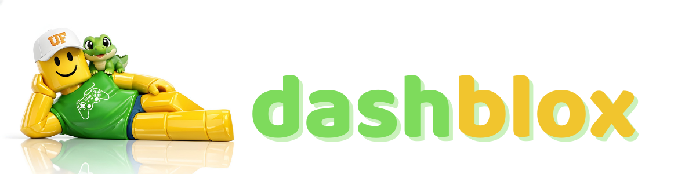

*AI-powered game development platform for shipping games faster from one unified workflow.*

*Built for Code4Change @ the University of Florida.*

## Inspiration
Game development is slow because teams constantly jump between **disconnected tools** for **3D assets, audio, planning, docs, and implementation**. We built **DashBlox** to eliminate that fragmentation and prove that a **single AI-native pipeline** can ship a **complete, polished game faster**.

## What it does
**DashBlox** is an **AI game production system** built specifically for game dev teams.
It lets us generate and ship **custom meshes**, generate **game-ready SFX and voices**, plan production in a built-in **Trello-style board**, and manage **dev docs** in one place.

We used it to build a complete wave-based zombie game where:
- **all game assets** were custom meshes created through our mesh workflow
- **all planning** was done in our dashboard Board
- **all game SFX** were generated with ElevenLabs
- **voice generation and voice cloning** are also supported for expansion content

## How we built it
We built a **fullstack web platform** (**Node.js + Express + vanilla frontend + MongoDB models**) with five core modules:
- **Models**: prompt enhancement (**Gemini via OpenRouter**), multi-provider generation (**Meshy/Tripo/Rodin/Replicate**), preview, conversion, and Roblox upload
- **Converter**: format conversion pipeline for **Roblox-compatible assets**
- **Audio**: **ElevenLabs** SFX generation, TTS, voice library, and voice cloning
- **Docs**: editable project knowledge base for `PLAN.md` and `PROGRESS.md` files
- **Board**: kanban workflow (our internal Trello equivalent) for sprint execution

Then we connected that pipeline directly to our Roblox game build loop: **generate assets and sounds**, **prioritize on the board**, **integrate in-game**, **playtest**, and **iterate**.

## Challenges we ran into
- Normalizing very different **AI provider APIs** into one reliable generation UX
- Converting model outputs into **Roblox-friendly formats** without breaking iteration speed
- Handling **async generation and polling** while keeping the dashboard responsive
- Keeping game quality high while building both the **production tool and the game** in hackathon time

## Accomplishments that we're proud of
- Shipped both the **platform** and a **complete polished game** using it
- Created a true **end-to-end workflow** from prompt to in-game asset/SFX integration
- Proved that an **integrated dashboard** can replace multiple disconnected tools
- Built a tested backend with strong route coverage (**84 passing tests**)
- Delivered a usable team workflow with **planning, docs, and asset pipelines** in one product

## What we learned
- **Tooling velocity** directly impacts game quality under hackathon constraints
- **Prompt quality** and provider abstraction matter as much as raw model quality
- **Planning discipline** (board + docs) prevents wasted effort in fast builds
- Building for Roblox requires **format, pipeline, and iteration decisions early**, not late

## What's next for DashBlox
- **One-click publish pipeline** from generated asset to Roblox package/library
- Shared asset history with **versioning and rollback**
- Team collaboration upgrades (**activity timeline, live board sync enhancements**)
- **In-game telemetry feedback loop** to auto-prioritize next asset/audio tasks
- Expanded voice workflows for dynamic NPC systems powered by **cloning + batch generation**

## Team
- **[Matheus Kunzler Maldaner](https://github.com/matheusmaldaner)**
- **[Luana Kunzler Maldaner](https://github.com/luanamaldaner)**
- **[Andrew Vu](https://github.com/adv-andrew)**
